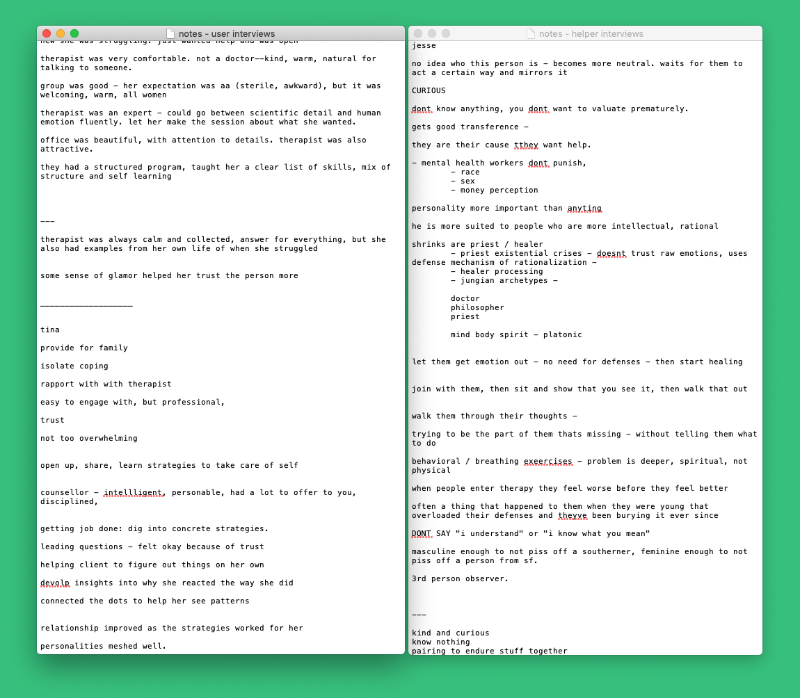
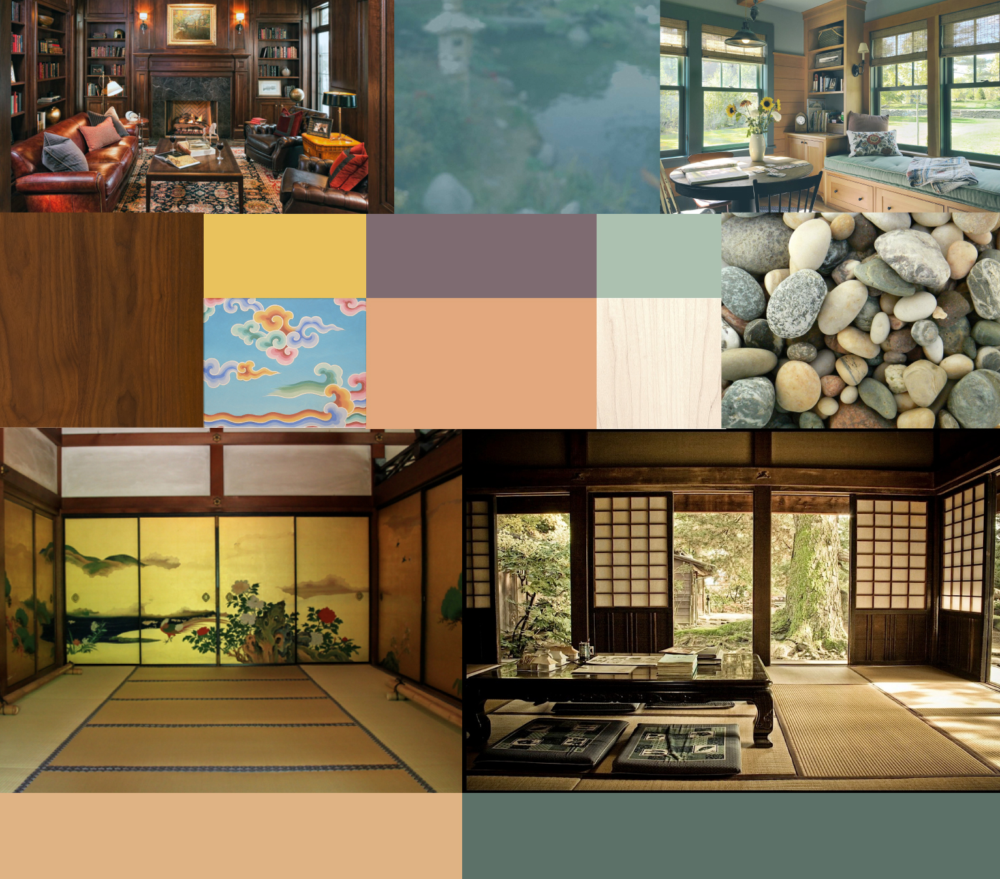
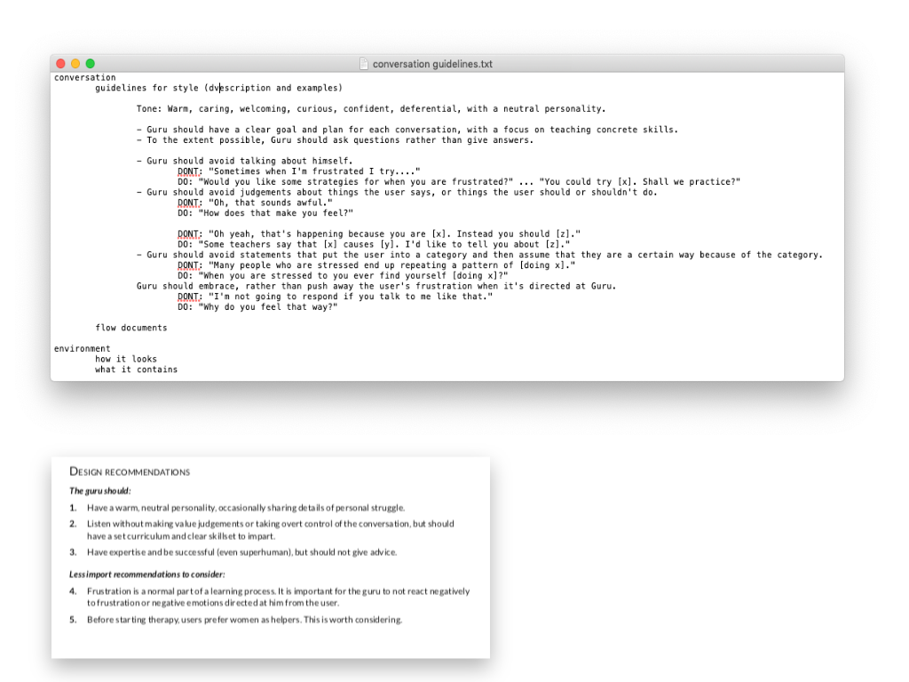
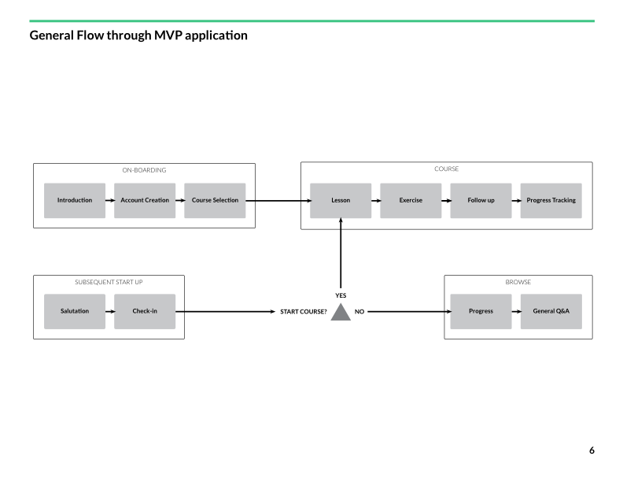
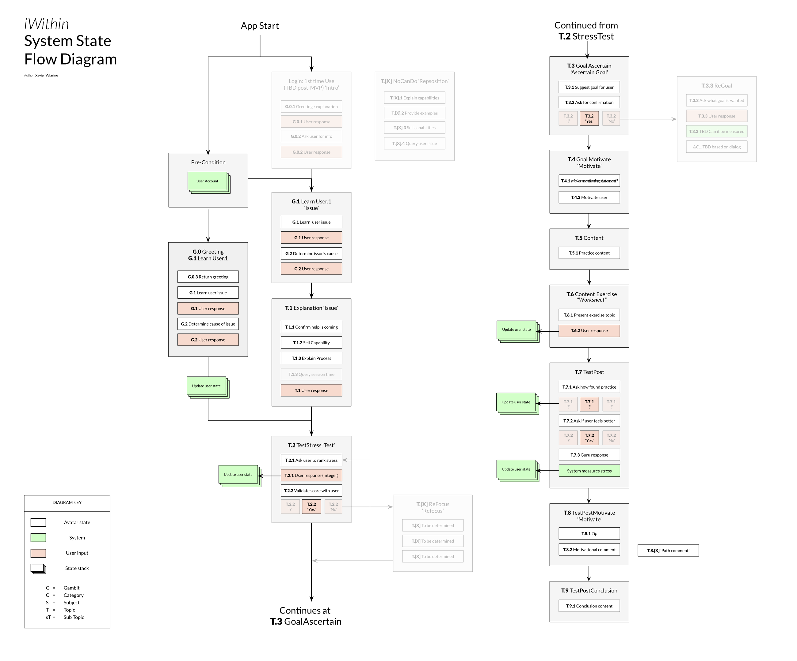
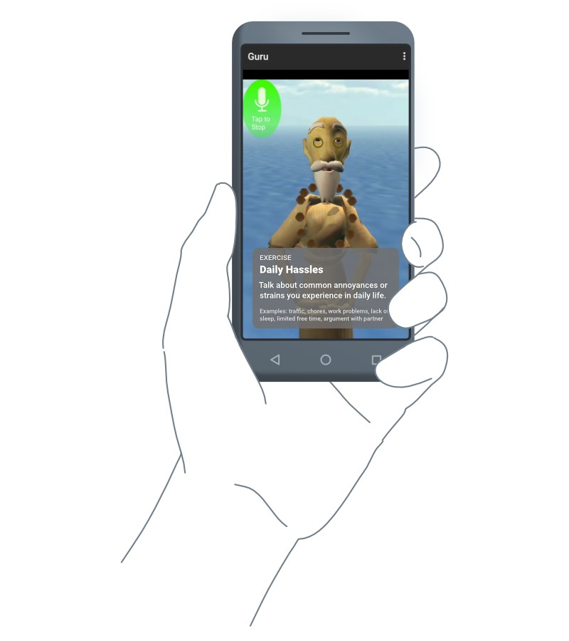

<section class="grid split-lists indenter:3/5 flip-top:kid border-top:3px border-accent:cyan">
## Background
Botanic is a start-up that builds conversational interfaces. I was part of a small cross-functional team assembled to build a wellness mobile application. The application would be offered through health insurers as a supplement to therapy, providing users with self-help content, guided exercises and baseline measurements.

The team was international: design and engineering in the Bay Area, an animator in Chile, and stakeholders in Australia and Singapore.

The user interface would have a visual component---an animated avatar which would act as a visual anchor for the conversation and as a buttress to the interlocutor's personality. 

---

### Goals
Design the avatar's persona and conversational style.

Help users identify and achieve personal milestones.

Show quantifiable progress to providers through user metrics.

---

### Role
Contract user research and interaction design.

As one  of two interaction designers on the project, I led the research program and collaborated on the user flows.

---

### Outcome
Research played an important role in uncovering what aspects mattered in a helper-patient relationship. Our final design:

1. Designed the avatar's persona to be fun and lighthearted, with the aim of making the application approachable
2. Used conversational techniques employed by therapists to create dialogue that was appropriate for self-help
3. Provided a formula for delivering content and exercises, giving users structure and making them active participants in their progress

</section>
<section class="grid indenter:3/5 flip-top:kid border-top:3px border-accent:magenta">

## Process
1. Interviewed stakeholders to outline business requirements for corporate purchasers
2. Designed and implemented a research program:
   * Identified main research questions
   * Recruited and interviewed participants
   * Analyzed results and presented them to stakeholders
   * Provided design recommendations based on findings
3. Collaborated on interaction flow diagrams, incorporating research findings into the final design

--- 

### User research: design and implementation
The research program was qualitative by design, recruiting 18 participants. Since the conversational interface would be based on the relationship between someone providing and someone seeking help, it was import to get perspective on both sides of the relationship. Our participants were broken up into two groups:

- **8 helpers**\
Including a psychiatrist, psychologist, counselor, a life coach and a Buddhist monk

- **10 end-users**\
People who had previously sought or were seeking help

Participants were recruited through various therapy groups, mailing lists and personal contacts. A survey form helped narrow the pool of participants. After each interview, participants was given a gift card as compensation.

---

### What did research uncover?

#### Users valued helpers who
- Empowered them to solve their own problems 
- Had a  set curriculum or system for the things that were being taught
- Assigned homework and worksheets\
\
_"[Worksheets] helped me think things through on my own"_
- There was a strong bias towards female helpers, who were perceived as less judgmental / prescriptive

#### Helper techniques included
- Not pretending to understand the problem; instead, creating a space where the user felt comfortable sharing
- Like a good waiter, they would show deference, matching a user's level of engagement
- Using Socratic questioning to help users engage in self-reflection
- Assigning worksheets and homework

#### Key takeaways
The research had validated some of our assumptions around how we should model the avatar, but it also uncovered a large blind-spot: worksheets.

The initial concept for the application would assess personal affect through tone of voice, sentiment analysis and facial expression. Research showed that it was more important to have a post-exercise check-in module where users would actively input this information.

---
### How did research affect the design?

The information uncovered by research was used to draft conversational guidelines for the copywriters, create mood boards for the animator, and outline key functionality in the user flow.

### Interaction design
The interaction flow was designed to lead users towards course material and pre-canned exercises. After completing a course the user would participate in a short question and answer module modeled after the worksheets (T.6 Content Exercise _Worksheet_) and a post check-in (T.7 TestPost). Answers would be compared against other sentiment data recorded by the system and converted into a baseline number. This data was then graphed in the "Progress" view so that user's could visualize their improvement.

</section>

<section class="grid indenter:3/5 flip-top:kid border-top:3px border-accent:yellow">

## End result
Modeling the application off of techniques employed by real-world helpers allowed us to create an application that was novel in implementation but still familiar in its structure.

Without user research we would have overlooked the worksheets as a means for data collection. This realization helped focus our efforts for the MVP roadmap: we could quickly build the content exercises and lower the priority of more complex versions of sentiment analysis.

