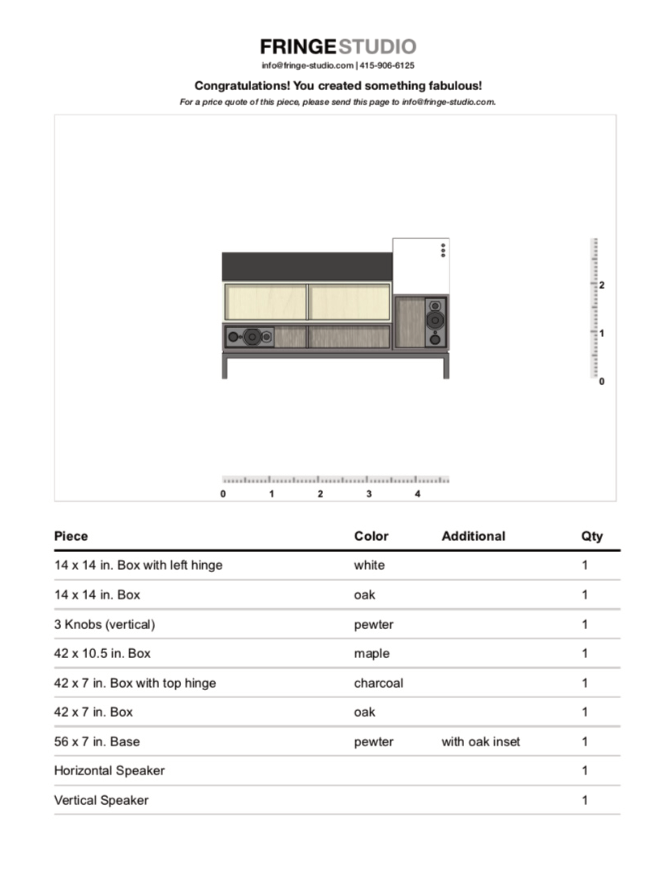

<section class="grid indenter:3/5 flip-top:kid border-top:3px border-accent:cyan">
## Background
Fringe studio offers a kit of modular furniture for interior designers to design custom furniture builds. The studio needed to define a process for handling complex custom orders.

---

### Goal 
Improve how Fringe studio's clientele submit orders for custom furniture builds.

---

### My Role 
 
End-to-end design and development, which entailed:

1. Understanding the problem
2. Examining project constraints
3. Designing a solution, and
4. Programming a working application.

</section>

<section class="grid indenter:3/2/4 split-lists flip-top:kid border-top:3px border-accent:magenta">
## Process
 
1. Interviewed the studio to understand order fulfillment
1. Made recommendations on how we could work around project constraints
1. Designed mockups exploring how clients would create furniture orders.
1. Interviewed interior designers to understand:
    - How they thought about putting together a furniture configuration
    - What the average configuration might look like
    - What their expectations were around ordering

---

### Constraints 
 
Order fulfillment was complicated, to say the least—standardizing shipping for the custom builds was near impossible with the custom orders and the studio's CMS gave little in the way of configurability and database access.

After considering spinning up a separate VPS or droplet, we decided the best way forward was to build a client-side only Javascript application.

The workflow would allow clients to visualize their custom build, generate a PDF, and then submit it to the studio for pricing. 

--- 

### Development 
 
Since the application was client-side, all the assets were bundled into a blob and dropped into a custom HTML element on one of the studio's webpages.

 

#### Project Scaffolding
Gulp was used for preprocessing and bundling, including preparing image assets.

SVG format was used for the images, which could be easily inlined as text into the distribution code. Another benefit of SVG was that the application could programmatically change the colors and background patterns through CSS styles.

 

The Gulp pipeline was built to prepare the images. It would stream the SVGs as raw text through a helper function (`addClass`) which would locate target colors and replace them with a CSS class. These classes were then targeted by the application JS to change the furniture color in synchrony with the dropdown menus.

Assigning multiple colors was done through two separate properties: one through the CSS `color` property and the other through the SVG `currentColor` property.

 
#### Recording data 
Each piece of furniture and its relative position were stored as a JSON object. When a client would go to print the cut sheet, the data object would be iterated through, generating a list of parts that the studio could itemize for the fabricator.

<video autoplay playsinline loop>
  <source src="/assets/video/mixi-modular-configurator-demo.mp4" type="video/mp4">
</video>

</section>

<section class="grid indenter:3/5 flip-top:kid border-top:3px border-accent:yellow">
## Outcome 
 
Whereas before clients would scan or fax hand drawn sketches of their custom builds, the tool created a standard document that was easy for the studio to understand visually. After review, the studio would submit the list of parts to the fabricator without worrying that something might have been lost in translation.

  <a href="https://xavier.valarino.com/fringe-studio/" >
    
	  →
    
    Try the _Mixi Configurator_
  </a>

</section>
