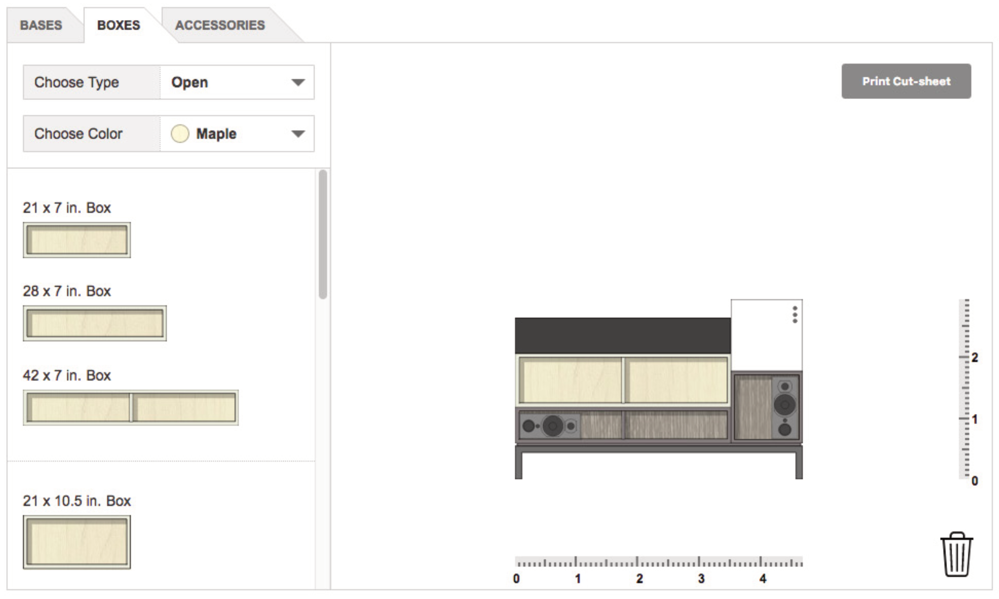

::: {.r-cell .span:4..}

:::

## Background {.r-cell .span:1-2 .border-top:h2}
::: {.r-cell .span:3.. .border-top:h2}
Fringe Studio offers a kit of modular furniture for interior designers. Since these designers would use the kit of parts for custom furniture builds, the studio needed to define a process for handling complex orders *Something missing*
:::
 
### Goal {.r-cell .span:3-3 .border-top:h2}
::: {.r-cell .span:4.. .border-top:h2}
Improve how Fringe Studio's clientele submit orders for custom furniture builds.
:::

### My Role {.r-cell .span:3-3 .border-top:h3}
::: {.r-cell .span:4.. .border-top:h3}
End-to-end design and development, which entailed: understanding the problem; examining project constraints; designing a solution; and programming a working application.
:::

## Process{.r-cell .span:1-2 .border-top:h2}
::: {.r-cell .span:3.. .border-top:h2}
1. Interviewed the studio to understand how orders were fulfilled 
1. Made recommendations on how we could work around project constraints
1. Designed mockups exploring how clients would create furniture orders.
1. User testing? How did it happen? small scale, budget constraint. 
:::

### Constraints {.r-cell .span:3-3 .border-top:h3}
::: {.r-cell .span:4.. .border-top:h3}
The studio's CMS was not meant for custom Javascript and our budget didn't allow for a separate dedicated server. This meant that the application would have to be client-side only.

Clients would generate a PDF that they could then submit to the studio for pricing. 
:::

### Development {.r-cell .span:3-3 .border-top:h3}
::: {.r-cell .span:4.. .border-top:h3}
Since the application was client-side, all the assets were bundled into a blob and dropped into a custom HTML element on one of the website pages.
:::

::: {.r-cell .span:1-3 .margin-right .align-c}

:::

::: {.r-cell .span:42 .justify-v:center}

#### Project Scaffolding
Gulp was used for preprocessing and bundling, including preparing images assets.

SVG format was used for the images, which could be easily inlined as text into the final distribution blob. Another benefit of using SVG was that the application could programmatically change the colors and background patterns through CSS styles.
:::

::: {.r-cell .span:1-2 .justify-v:center .align-r}
The Gulp pipeline was built to prepare the images. It would stream the SVGs as raw text through a helper function `addClass`, which would locate target colors and replace them with a CSS class. These classes were then targeted by the application JS to change the furniture colors.

Assigning multiple colors was done through two separate properties: one through the CSS `color` property and the other through the SVG `currentColor` property.
:::

::: {.r-cell .span:3.. .padding-left:l}

:::

::: {.r-cell .span:2-5 .align-c }
#### Recording data 
Each piece of furniture and it's relative position in a JSON object. When a client would go to print the cut sheet, the data object would be iterated through, generating 
:::

::: {.r-cell .span:1-2}

:::

::: {.r-cell .span:2..}
<!--TODO Add video showing third panel with the data obj being modified.-->

:::

## Outcome {.r-cell .span:1-2 .border-top:h2}
::: {.r-cell .span:3.. .border-top:h2}
Whereas before clients would scan or fax hand drawn sketches of their custom builds, the tool created a standard document that was easy for the studio to understand visually. After review, the studio would submit the list of parts to the fabricator without worrying that something might have been lost in translation.
:::

### [&#8594; Try the prototype](https://xavier.valarino.com/fringe-studio/) {.r-cell .span:3.. .align-c }

::: {.r-cell .span:3.. .shadow}

:::
