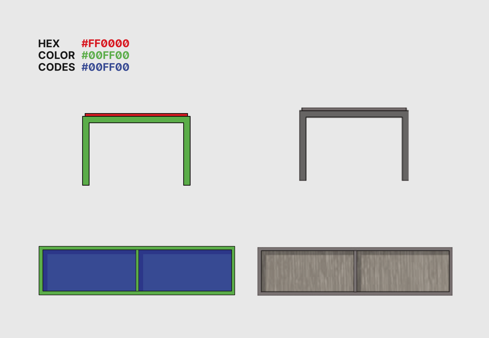

<section class="grid indenter:3/5 flip-top:kid border-top:3px border-accent:cyan">

## Background
Fringe Studio offers a kit of modular furniture for interior designers to design custom furniture builds. 
The studio needed a new way to handle custom orders.

---

### Goal 
Improve how Fringe Studio's clientele submit orders for custom furniture builds.

---

### Role 
End-to-end design and development, which entailed:

* Understanding friction with ordering
* Examining project constraints
* Designing and testing a solution
* Programming a working application.

---
### Outcome
Whereas before clients would scan or fax hand drawn sketches of their custom builds, the applicaton created a standard document that was easy for the studio to understand visually. After review, the studio would submit the list of parts to the fabricator without worrying that something might have been lost in translation.

</section>

<section class="grid indenter:3/2/4 split-lists flip-top:kid border-top:3px border-accent:magenta">
## Process
 
1. Interviewed the studio to understand order fulfillment
1. Made recommendations on how we could work around project constraints
1. Interviewed interior designers to understand:
    - How they thought about putting together a furniture configuration
    - What the average configuration might look like
    - What their expectations were around ordering
1. Designed, tested, and implemented an application 

---

### Constraints 
Order fulfillment was complicated. Standardizing shipping for the custom builds was near impossible, since larger orders usually needed to be palletized. To add insult to injury, the studio's CMS gave little in the way of configurability and database access.

We considering spinning up a separate virtual private server. After running into [_Cross-Origin Resource Sharing_](https://developer.mozilla.org/en-US/docs/Web/HTTP/CORS) issues, we were forced to reassess our timeline and budget. We decided the best way forward was to build a client-side only application.

The proposed workflow would allow clients to visualize their custom build, generate a PDF, and then submit it to the studio for pricing. 

---

### Designing the interface
My initial concept for selecting furniture components was to have users modify furniture parameters before dragging and dropping them onto a canvas. I saw two benefits to this approach:

1. If everything fit neatly within the selection panel, I wouldn't have worry about a panel scrollbar causing issues with discoverability.

2. It aligned well with how I was starting to conceptualize the problem technically; from an _object oriented_ perspective, the furniture components could be described as one of three classes of object with variable parameters.    

#### Testing how users selected furniture
A simple prototype was created to test the concept. It performed poorly. The interface just didn't click for majority of participants. Half didn't know that the furniture module was draggable, and 2&frasl;5 hated selecting dimensions through the slide control.

<!-- keep these elements in the same grid row -->

#### Updating the selection panel's design
After reviewing my interview notes, it was apparent that I had overlooked a key part of how interior designers were approaching the problem. My initial design had assumed they knew what dimensions they wanted for each piece, while in actuality, that constraint was only true for the overall dimension.

The tool needed to allow for a certain level of play: interior designers wanted to be able to see all the pieces laid out; they wanted to compare them side by side. They were thinking about things spatially, not categorically.

I updated the design for the panel, moving it to the left hand side and listing out each permutation as it's own item. Although there were some issues with users overlooking the dropdown controls, the second round of testing was much more reassuring. One thing that surprised me: every participant managed scroll to bottom of the panel; the scrollbars ended up being a nonissue.

---

### Development 
The distribution code for the application was essentially a concatenated blob of HTML, SVG symbols, and JS. The HTML was a simple set of frames that the JS would attach event handlers to. JS modules were bundled by [Browserify](http://browserify.org/).

I used jQuery [Draggable](https://jqueryui.com/draggable/) and [Droppable](https://jqueryui.com/droppable/)to remove the overhead of implementing drag-and-drop functionality.

SVG format was used because it could be easily inlined as text into the distribution bundle. The format made changing image colors and background patterns easy since their color properties could be controlled through CSS styles.

A [Gulp](https://gulpjs.com/) pipeline was built to prepare the images. It would stream the SVGs as raw text through a helper function (`addClass`) which would locate the target red, green, and blue colors, replacing them with a CSS class. The application JS to change the classes on the furniture in synchrony with a selection in the dropdown menu.

Assigning multiple colors was done through two separate properties: one through the CSS `background-color` property and the other through the SVG `fill` property.

 
#### Recording data 
Each piece of furniture and its relative position were stored in a JSON object. When a client would go to print the cut sheet, the data object would be iterated through, generating the printable list of parts.

<video autoplay playsinline loop>
  <source src="/assets/video/mixi-modular-configurator-demo.mp4" type="video/mp4">
</video>

</section>

<section class="grid indenter:3/5 flip-top:kid border-top:3px border-accent:yellow">
## End result	 
The application created an interactive way for interior decorators to explore _Mixi Modular_ furniture line offerings and generated a single source of record that reduced confusion between the client, studio and fabricator when an order was placed.

  <a href="https://xavier.valarino.com/fringe-studio/" >
    
	  →
    
    Try the Application
  </a>

</section>
