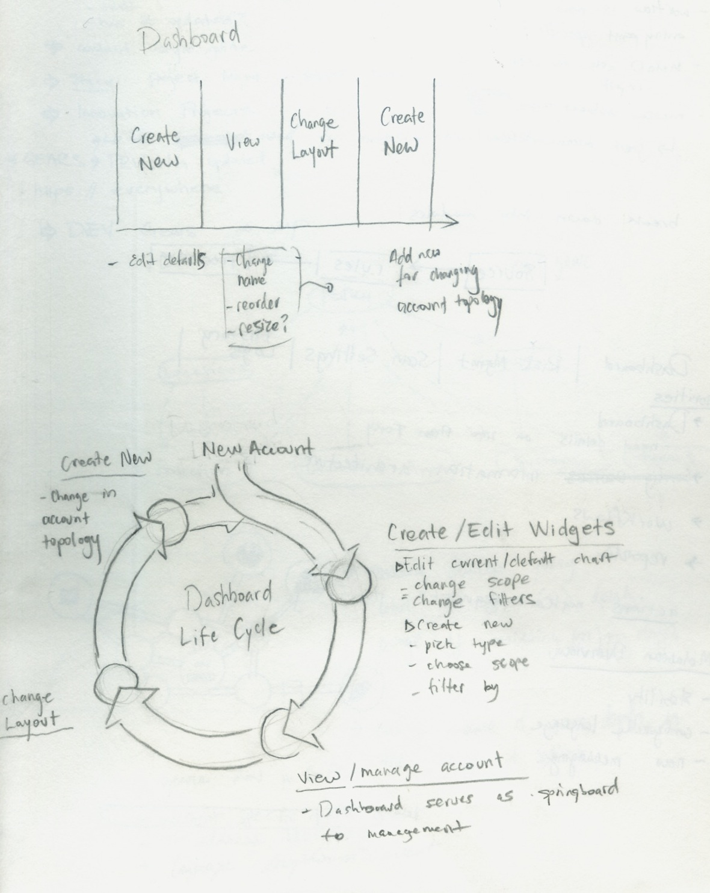
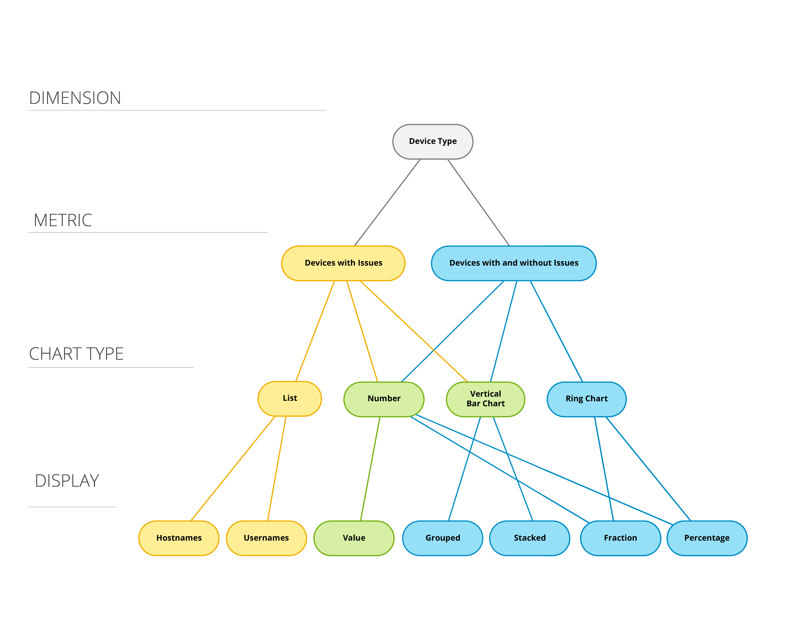
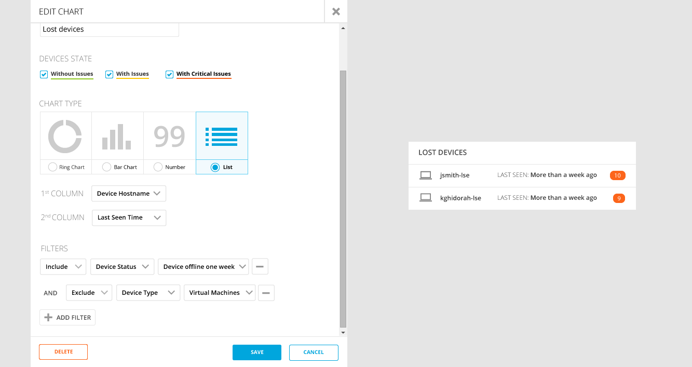
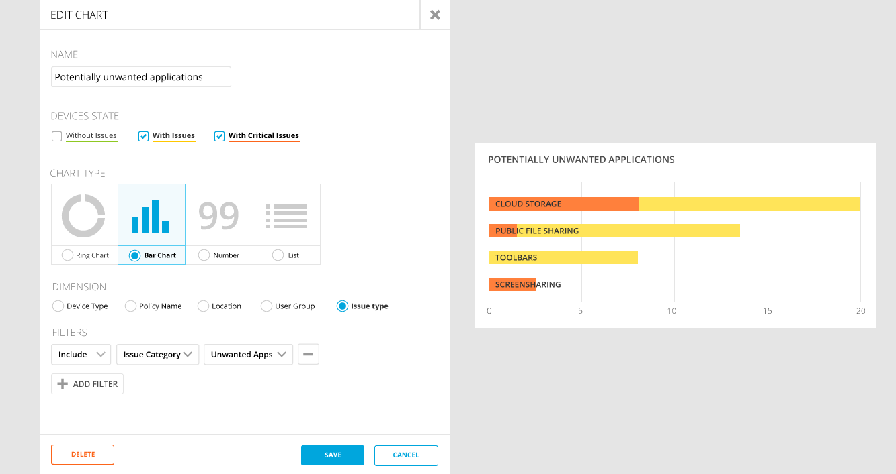
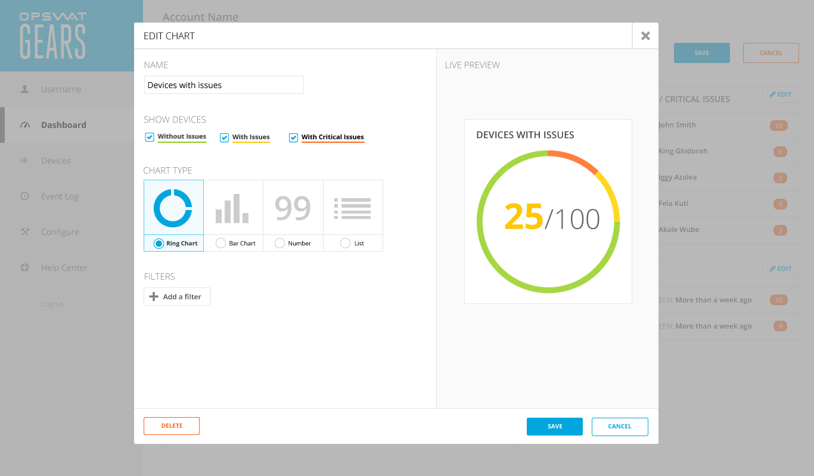

Understanding how parts make up the whole

### Background
GEARS was a SaaS application for monitoring devices on corporate networks. 

Admin would define rules that the application would report back as out of compliance (as an issue).

It would report issues based on user configured security policies. We had recently added new metrics for triaging devices and needed to update the dashboard to reflect this change. This gave us the opportunity to make the dashboard more useful to customers with atypical network topologies.

### Goal
Provide administrators with configuration options for personalizing their account dashboard.

### Role
Designed the interaction pattern and user interface for dashboard customization.

### Process
**What's the goal here???**

- Mapped application data to meaningful visual representations
- Designed a modal window for configuring the visualizations
- Incorporated the configuration feature into the dashboard

#### The problem
How could I align user goals with the database schema to create something useful?

 The application recorded device information across 3 dimensions:
    - Device type
    - Device location
    - Security policies

The metrics applied to these dimensions were: 
    - Number of issues
    - Issue Severity

*I created...*
A tree diagram was used to map how application data could be represented visually.

The tree diagram was then used as a rubric for the controls in the modal editor.

#### Frequency of use
An important design consideration was how frequently administrators would configure the charts on their dashboard. - why? most frequent actions where most prominent, so less frequent actions shouldn't get in the way.

*ACTIVE VOICE*
> admins used the dashboard to...
> my design did...

The primary use of the dashboard was to drill down into problematic devices. Configuring the charts was a less frequent interaction, usually occurring when *there was a change in security policy / change in network topology*
when the account was in flux (a change in security policy, added/removed devices). To keep ancillary interactions from interfering, configuration options were hidden behind an _edit_ state.

### Outcome
My final design broke the dashboard into three modes:
1. *Daily Use:* using the dashboard as a springboard into devices that needed further investigation 

1. *Arrangement:* moving the widgets around and resizing them. 
2. *Configuration:* Editing chart widgets through a modal window
The result was a highly configurable dashboard with an interface that was clean and goal-oriented.

TODO: Fold this in Later

*WORKING SECTION TITLE*
Diving deeper into the design process

#### Thinking of the final design
Chart widgets would reflow based on a grid system, spanning either two or three columns. Their width were predetermined and based on which chart visualization had been chosen.

*[ Make sure your using chart **dimesions** appropriately here... ]*

GEARS Cloud could group data by the device type, the policy being enforced, or the location. I decided to use these as chart dimensions. These dimensions would be measured by the number of devices that did or did not have issues. (An issue was an individual parameter of of a policy.)
Diagrams were created to understand how this would result in an actual data visualization.

Using those diagrams as my point of departure, I designed the modal config windows alongside the chart they would create.
Available options in the ‘Group chart items by’ section would change based on the selections made above it

Once all stakeholders had signed off on the user interaction, I cleaned up the visual style. In order to reduce visual clutter, I switched out the chart borders for a light gray background, and distinguished the left navigation by making it all one color.
