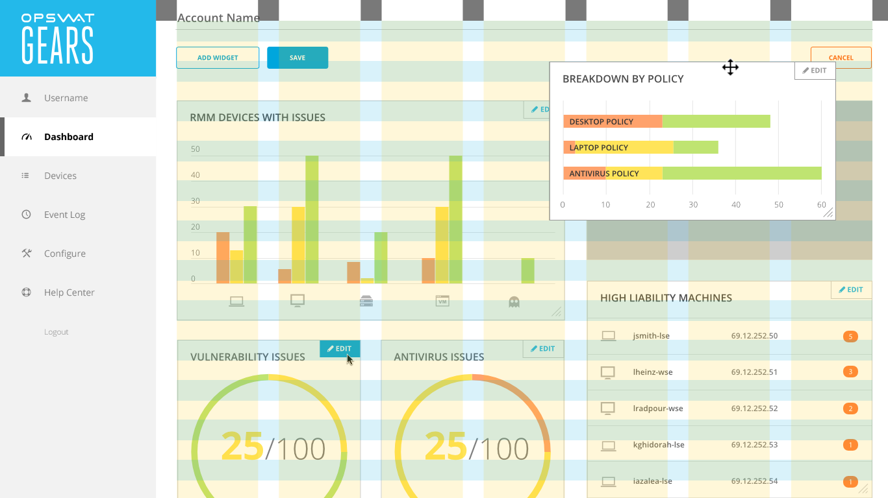

<section class="subgrid indenter flip-top:kid border-top:3px border-accent:cyan">
## Background  
GEARS was a SaaS application for monitoring devices on corporate networks.

Administrators would define security policies for networked devices, and the application would report back any issues. We had recently added new metrics for triaging devices and needed to update the dashboard to reflect this change. This gave us the opportunity to make the dashboard more useful to customers with atypical network topologies.

---

### Goal 
Provide administrators with configuration options for personalizing their account dashboard.

---

### My Role 
Designed the interaction pattern and user interface for dashboard customization.

</section>

<section class="subgrid split-lists indenter flip-top:kid border-top:3px border-accent:magenta">
## Process 
 
1. Mapped application data to meaningful visual representations
2. Designed a modal window for configuring the visualizations
3. Incorporated the configuration feature into the dashboard

---

### Problem  

How could I align user goals with the database schema to create something useful?

**The application recorded device information across three dimensions:**

- Device type
- Device location
- Security policies

**The metrics applied to these dimensions were:**

- Number of issues
- Issue Severity
    

 
I created tree diagrams to map how application data could be represented visually.
I then used the tree diagrams as a rubric for the controls in the modal editor.
 

 

 
#### Frequency of use
An important design consideration was how frequently administrators would configure the charts on their dashboard. The dashboard was like a springboard, giving administrators a birds eye view of the network while providing a clear route to devices that needed review. 

The primary use of the dashboard was at to, all at once, give a birds eye view of the network while giving the administrator a way to effortlessly drill down into problematic devices.
I wanted to make sure that these actions remained prominent, while giving enough visual affordance to the chart configuration features. 
 

 

 
#### Modal editing
Configuration options were hidden behind an _Edit Dashboard_ button. This was done as a safeguard against users accidentally moving the chart widgets when trying to click on chart elements. The colors would dim to queue the user of the state change.
 

 

 

#### Customizing the layout
Chart widgets were design to reflow based on a grid system, spanning either two or three columns. Their width were predetermined and based on which chart visualization had been chosen.

</section>

<section class="subgrid split-lists indenter flip-top:kid border-top:3px border-accent:yellow">
## Outcome 
 
My final design broke the dashboard into three modes:

1. **Daily Use**---using the dashboard as a springboard into devices that needed further investigation 

2. **Arrangement**---moving the widgets around and resizing them. 
3. **Configuration**---Editing chart widgets through a modal window

The result was a highly configurable dashboard with an interface that was clean and goal-oriented.

 
Once all stakeholders had signed off on the user interaction, I cleaned up the visual style. In order to reduce visual clutter, I switched out the chart borders for a light gray background, and distinguished the left navigation by making it all one color.

</section>
