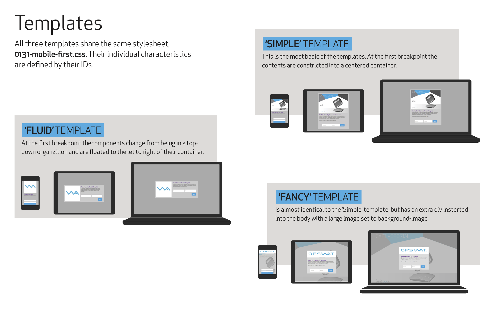
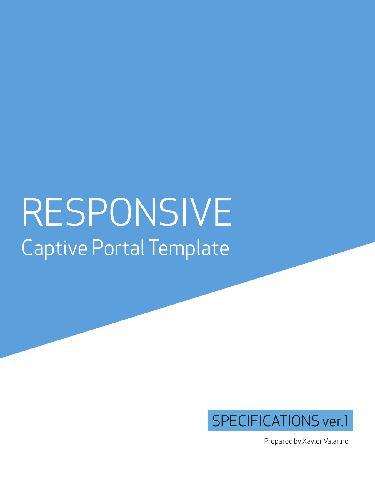
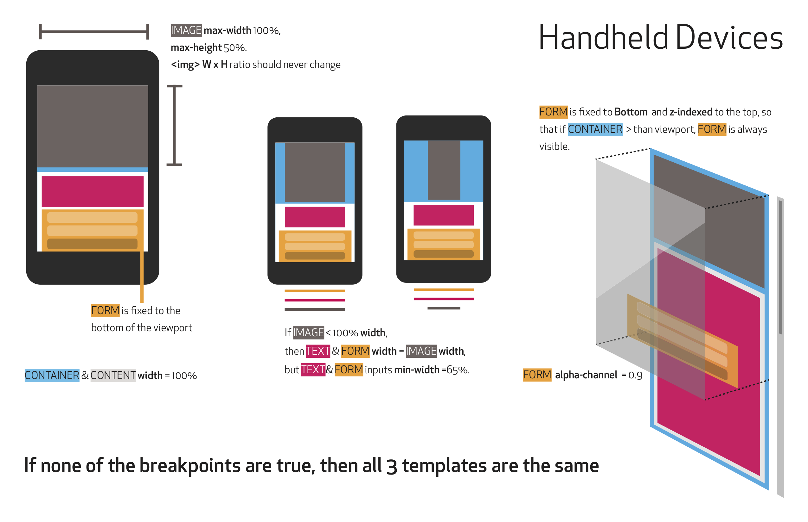
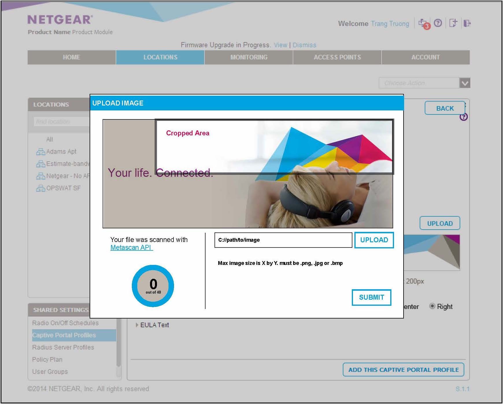

<section class="grid indenter:3/5 flip-top:kid border-top:3px border-accent:cyan">
## Background 
Alongside offering their own SaaS product, OPSWAT was contracted to build a wireless cloud management system for Netgear. I was lead designer for the project.
The application included features for setting up a captive portal—a webpage that newly connected users would have to pass through before gaining access to the broader network. Corporate clients wanted to personalize these entry points.

--- 

### Goal 
Design a way for administrators to customize the captive portal.

---

### My Role 
Designed the setup wizard for the captive portal, exploring the UX impact of various configuration options to ensure that administrators could successfully create and customize their captive portals.

</section>

<section class="grid indenter:3/2/4 flip-top:kid border-top:3px border-accent:magenta">
## Process 
I created mockups and prototypes to help me understand how the the template components should behave.

---

### Mockups 
I created three templates, exploring how they rendered in different viewports.

---

### Prototypes 
I built functional prototypes of the templates to investigate the assumptions made in the mockups. CSS media queries were used to test for different devices (mobile phones, tablets, and laptop/desktops). A series of images with different aspect ratios were used to test for user-generated content.
These prototypes gave immediate visual feedback of the limits I'd encounter while designing the templates.

<!--*What is the goal of these points? what is the value of these endeavors? one more sentence to close the loop...*-->

<video class="" autoplay playsinline loop>
  <source src="/assets/video/netgear-captive-portal-prototype.mp4" type="video/mp4">
</video>

---

### Specifications 
Along with the prototypes, I drafted a specifications document to send to the engineering team in Vietnam. It outlined the three templates we would offer and explained the logic used in the prototypes.
I then translated the specifications into discrete and actionable tickets.

</section> 

<section class="grid indenter:3/5 flip-top:kid border-top:3px border-accent:yellow">
## Outcome 
The delivered document gave the engineering team blueprints for the templates, allowing them to plug them into the larger CP setup wizard.

</section>
