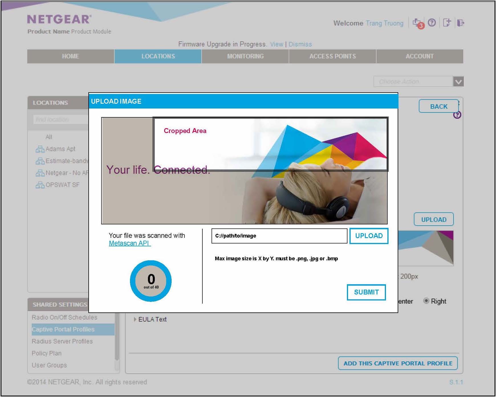
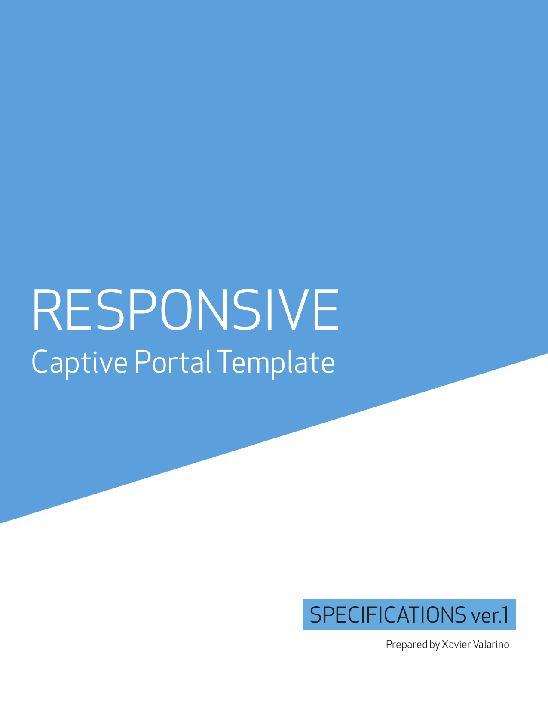
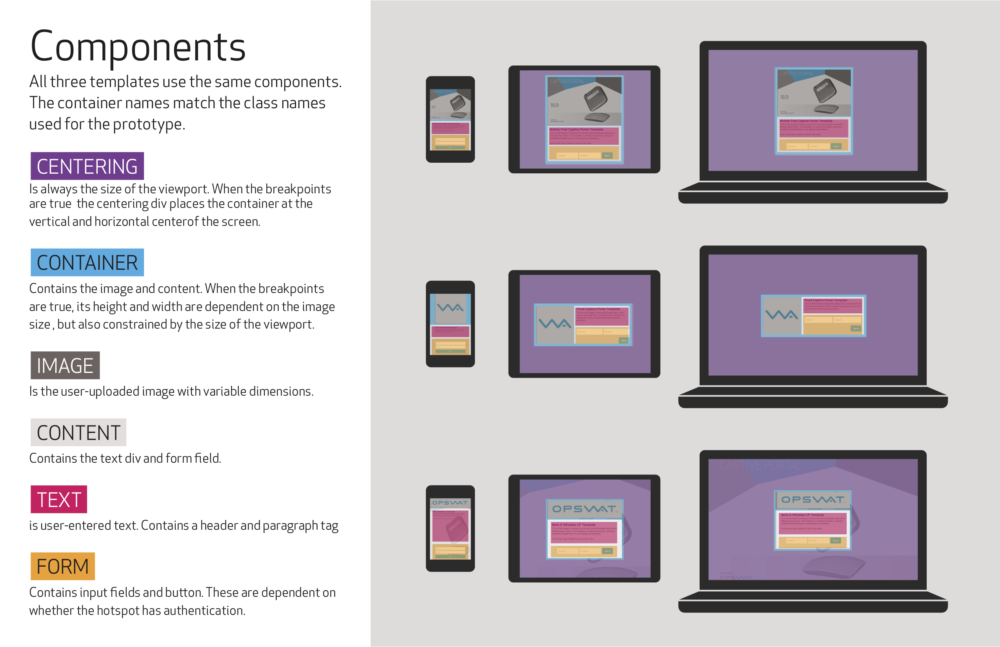
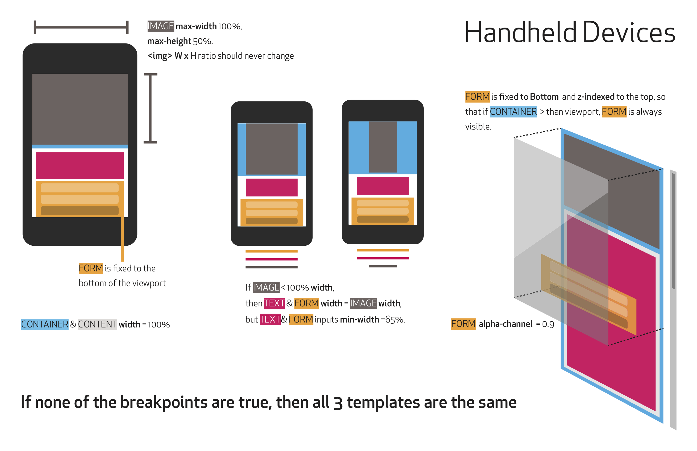
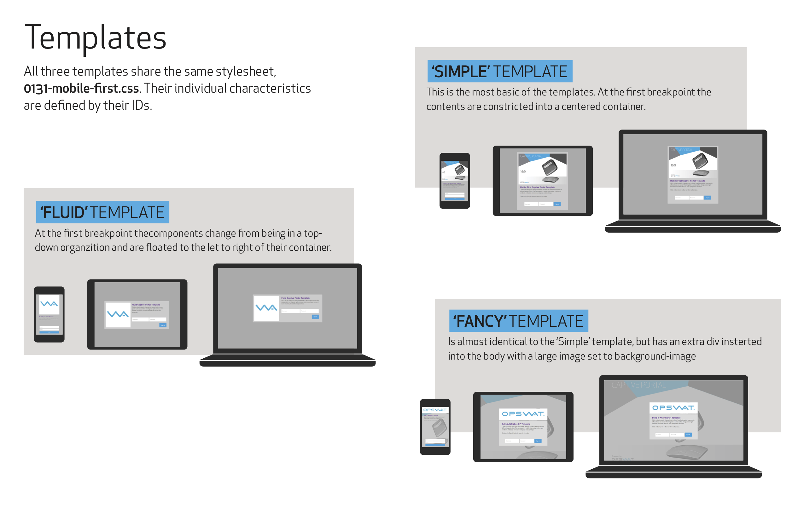

Defining how the parts behave

## Background
Alongside offering their own SaaS product, OPSWAT was contracted to build a wireless cloud management system for Netgear. I was lead designer for the project.
The application included features for setting up a captive portal—a webpage that newly connected users would have to pass through before gaining access to the broader network. Corporate clients wanted to personalize these entry points.

## Goal
Design a way for administrators to customize the captive portal (CP).

## Role
Designed the setup wizard for the captive portal (CP), exploring the UX impact of various configuration options to ensure that administrators could successfully make usable CPs.

## Process
Mockups and prototypes were created to understand how the the template components should behave.

#### Mockups
**Passive voice no-no**
*I created* Three templates were mocked up, exploring how they rendered in different viewports.

#### Prototypes
*The goal of these points. what is the value of these endeavors? one more sentence to close the loop...*

...In order to make sure these would work under variable conditions (why variable?)

Functional prototypes of the templates were built to investigate the assumptions made in the mockups. CSS media queries were used to test for different devices (mobile phones, tablets, and laptop/desktops). A series of images with different aspect ratios were used to test for user-generated content. Saw what the limits where.

#### Specifications
Along with the prototypes, a specifications document was sent to the engineering team. It outlined  the three templates we would offer and explained the logic used in the prototypes.

Offshore engineering team
Testing and tickets fixing issues
translated design into actionable and tactical tickets

## Outcome
Explained to the engineering team the logic behind the prototypes so that they could build the templates, plugging them into the larger CP setup wizard.

The delivered document gave the engineering team blueprints to develop the CP setup wizard and connect it to the templates. 

