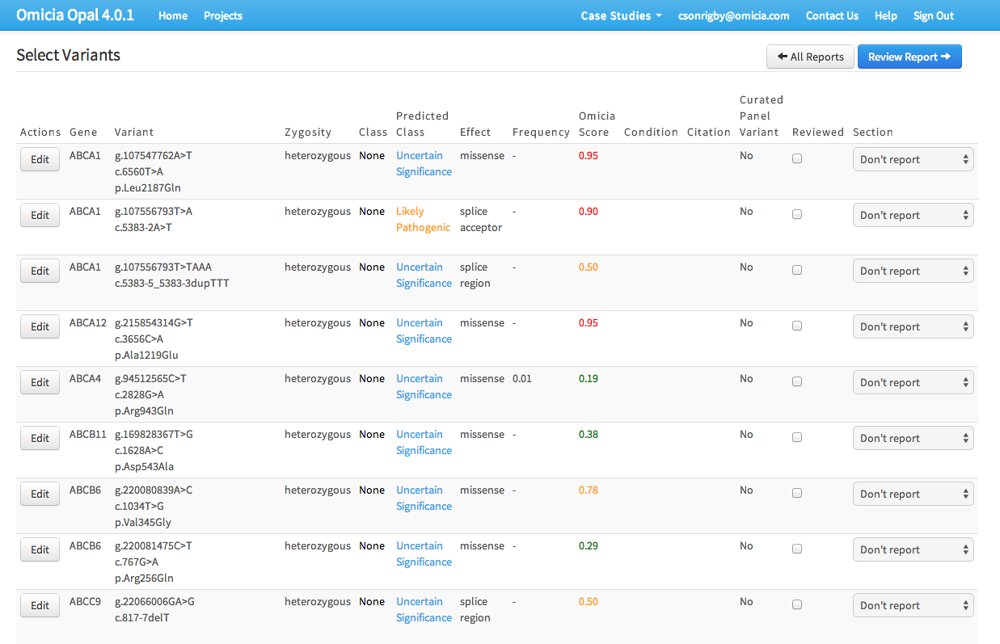
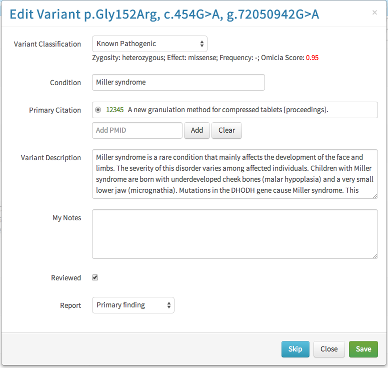
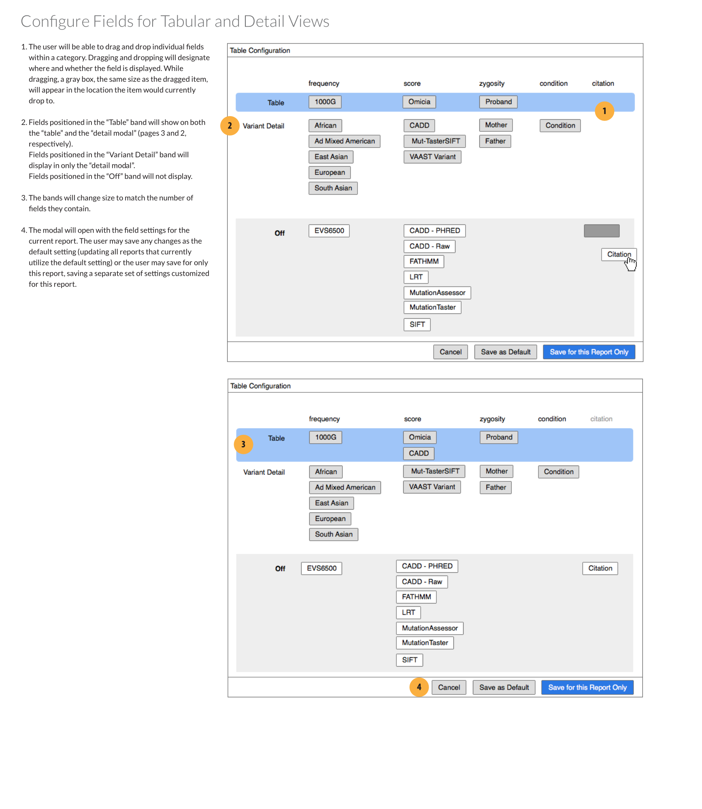
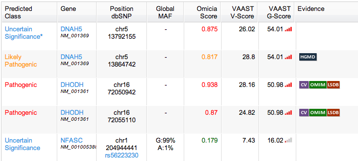
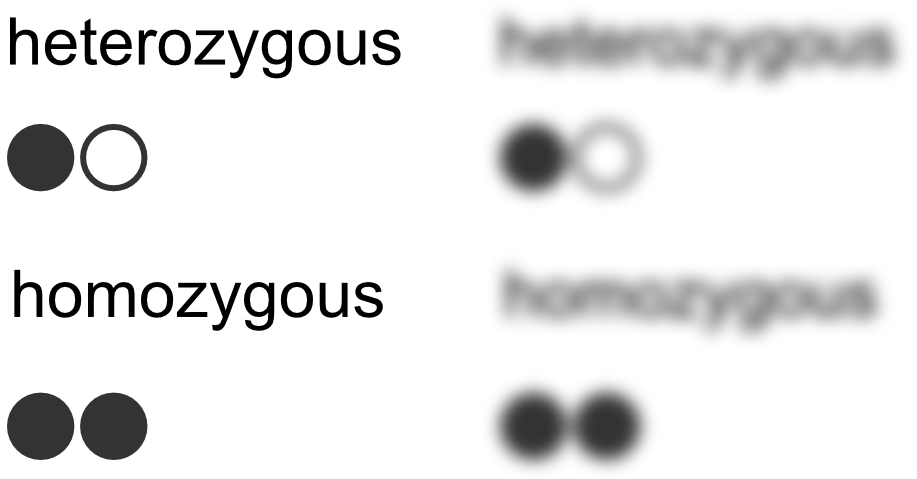
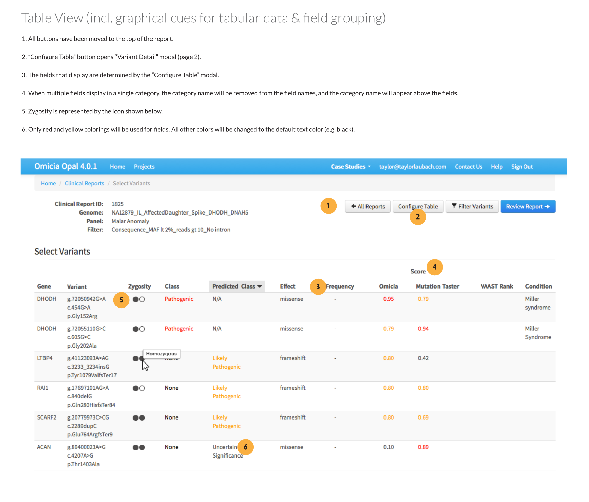
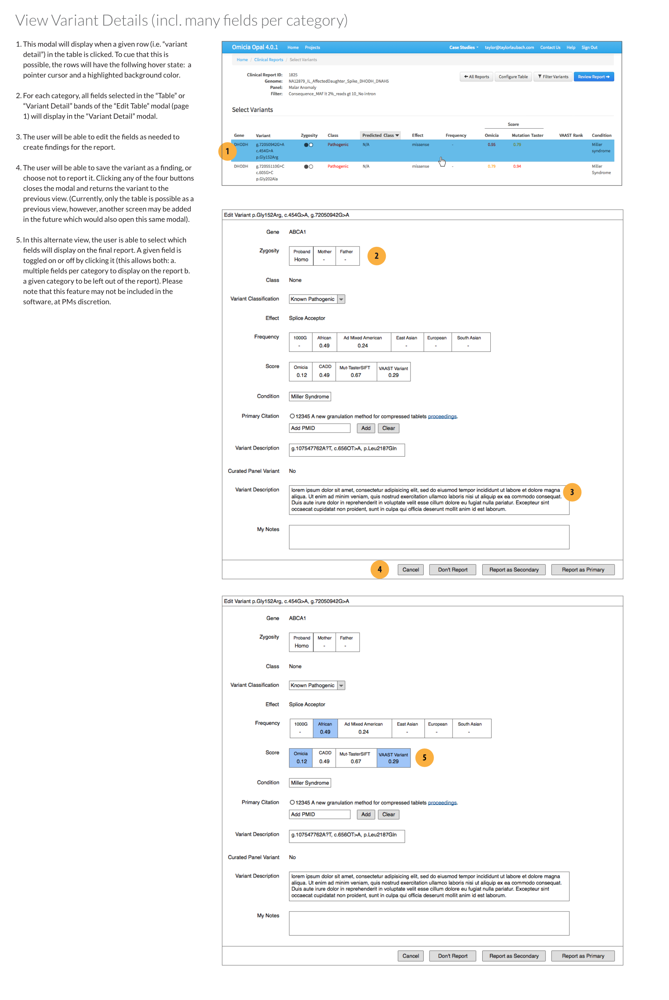

<section class="grid indenter:3/5 flip-top:kid border-top:3px border-accent:cyan">

## Background
Omicia (now Fabric Genomics) sequences genetic samples. Their enterprise web application is used to find and  report genetic variants that may cause disease, helping doctors diagnose current or future illness.

The application had originally been deigned as a research tool. As their customer base became more diverse, so did the application's use cases.

This misalignment was manifested itself in clinical laboratories: clinicians were making mistakes in their variant reports.

---

### Goal 
Improve how clinicians create and submit their findings.

---

### Role 
One of two interaction designers hired specifically for a series of sprints meant to improve clinical workflows.

My role was to audit and overhaul the existing reporting feature.

---

### Outcome
The updated user interface put the clinician's job first, giving them control over how they sifted through data and simplified report creation.

</section>
<section class="grid indenter:3/2/4 split-lists flip-top:kid border-top:3px border-accent:magenta">

## Process

1. Interviewed the product team to understand the software and use cases.
1. Interviewed clinicians to understand their workflow.
1. Designed wireframes for:
    - Main table view
    - Table configuration
    - Report creation

---

### Drawbacks of the Existing User Interface

During interviews, clinicians expressed frustration with three areas:

1. Depending on the type of report, the table's data fields weren't always useful.
1. Not being able to pivot data on the table columns.
1. Selecting genetic variants for the report was cumbersome, requiring ticking a checkbox, using dropdowns, and then saving them to an intermediate list.

--- 

### Field Configuration Modal
I designed a new configuration modal which would toggle which fields were visible. The configuration could be saved as the application default or for the report being worked on. Toggling fields on or off was done by dragging and dropping them into one of three rows:

1. **Table**: the field would appear on both the table and individual variant views
1. **Variant Detail**: the field would appear on only individual variant views. Essentially, the information was important enough that the clinician wanted to see it when they were examining a selected gene variant, but not enough to clutter the main table.
1. **Off**: The field would not appear in either view.

### Improving the Interface

#### Removing Unnecessary Information
I recommended limiting the colors to yellow and red, which were the only two that provided actionable information. I also suggested removing links in table cells, and instead making the whole table row a link target that would open the variant modal. Links to other information would be placed inside that view.

 
#### Improving Legibility
One of the fields recorded in the table was the gene's zygosity---whether the gene had the same alleles or a dominant and recessive one. 

At small scale (or for those with poor vision), the two words look almost identical.

I designed an icon that was easy enough to associate with the genotype and would quickly convey zygosity. The icon had the added bonus of taking up less horizontal screen real estate. 

#### Moving Buttons to One Location
All controls that didn't affect individual variant entries were moved to a button cluster above the table.

#### Editing Reported Fields
An optional design was included: a feature to toggle which fields were added to final report _per individual gene variant_. The fields would appear as button clusters that could be toggled on or off.

</section>
<section class="grid indenter:3/5 flip-top:kid border-top:3px border-accent:yellow">

## End result 
The submitted wireframes introduced a purpose-built workflow for lab clinicians and outlined a clear set of new features for the product and engineering teams.

</section>
