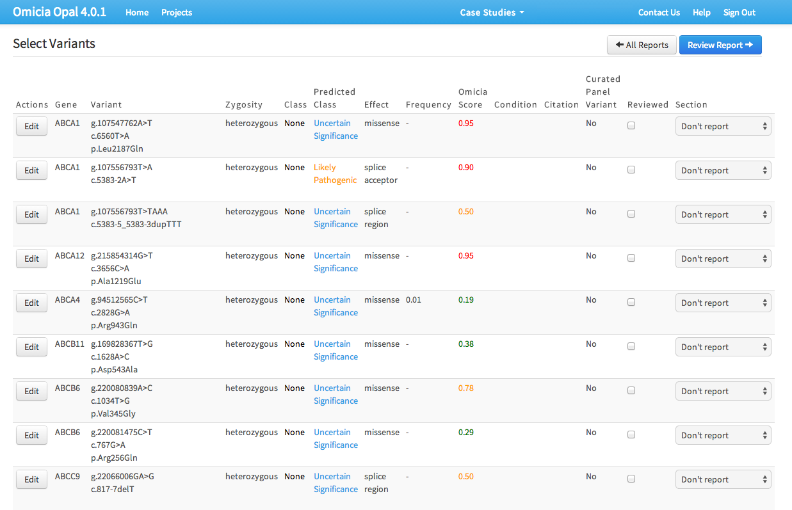

<section class="grid indenter:3/5 flip-top:kid border-top:3px border-accent:cyan">

## Background
Omicia (now Fabric Genomics) sequences genetic samples. Their application helps clinical lab find and report genetic variants that may cause disease, helping primary care physician diagnose current or future illness.

---

### Goal 
Improve how clinicians create and submit their findings.

---

### My Role 
Interaction design, hired specifically for a series of sprints that incorporated new features.

</section>
<section class="grid indenter:3/2/4 split-lists flip-top:kid border-top:3px border-accent:magenta">

## Process

1. Interviewed the product team to understand the software and new features being added.
1. Interviewed clinicians to understand their workflow.
1. Designed wireframes for:
    - Main table view
    - Table configuration
    - Report creation

---

### Drawbacks of the existing user interface

The data-heavy table offered an overwhelming amount of information, but no way to pivot the data.

On top of that, selecting which genetic variants would go into the report was cumbersome---clinicians would have to tick checkboxes, use dropdowns, and save them to an intermediate list before generating the report. 

--- 

### Improving the interface

#### Removing unnecessary information
I recommended limiting the colors to yellow and red, which were the only two that provided actionable information. I also suggested removing links in table cells, and instead making the whole table row a link target for opening a variant modal. Links to other information would be placed inside that view.

 
#### Legibility
One of the fields recorded in the table was the gene's zygosity---whether the gene had the same allele or a dominant and recessive one. 

At small scale (or out of focus), the two words look almost identical.

I designed an icon that was easy enough to associate with the genotype and would quickly convey zygosity, while not eating into horizontal screen real-estate. 

#### Moving buttons to one location
All buttons where moved to one cluster location at the top of the table.

#### Giving clinicians control over what appears in the report
An optional design was included: a feature to toggle which fields are added to final report _per selected gene variant_. The fields would appear as button clusters that could be toggled on or off.

### The configuration modal
To complement the optional reporting feature, and because there were more fields available than would fit in the table, I designed a new configuration modal. Toggling fields on or off was  done by dragging and dropping them into one of three rows:

1. **Table row**: the field would appear on both the table and individual variant views.
1. **Variant detail row**: the field would appear on only individual variant views. Essentially, the information was important enough that the clinician wanted to see it when they were examining a selected gene variant, but not enough to clutter the main table.
1. **Off row**: The field would not appear in either view.

</section>
<section class="grid indenter:3/5 flip-top:kid border-top:3px border-accent:yellow">

## Outcome 
The final design put the clinician's job first, giving them control over how they sift through data and simplifying how they built their reports.

</section>
