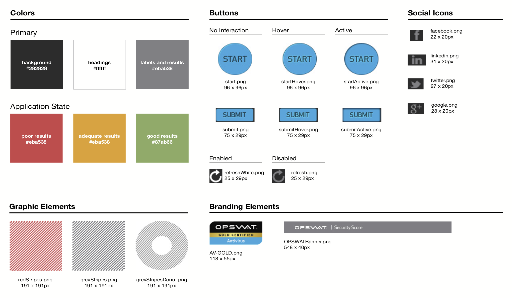
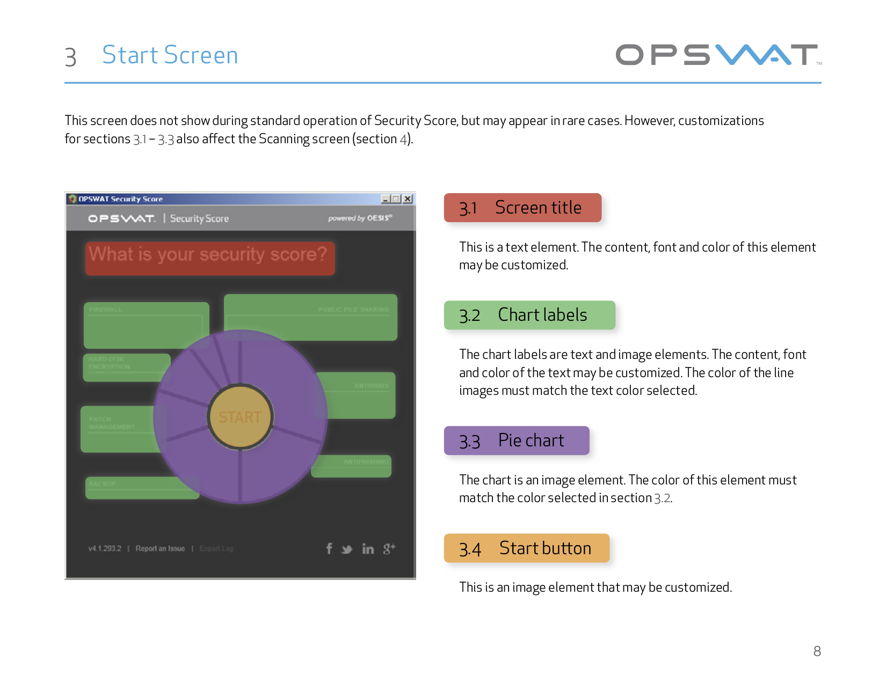
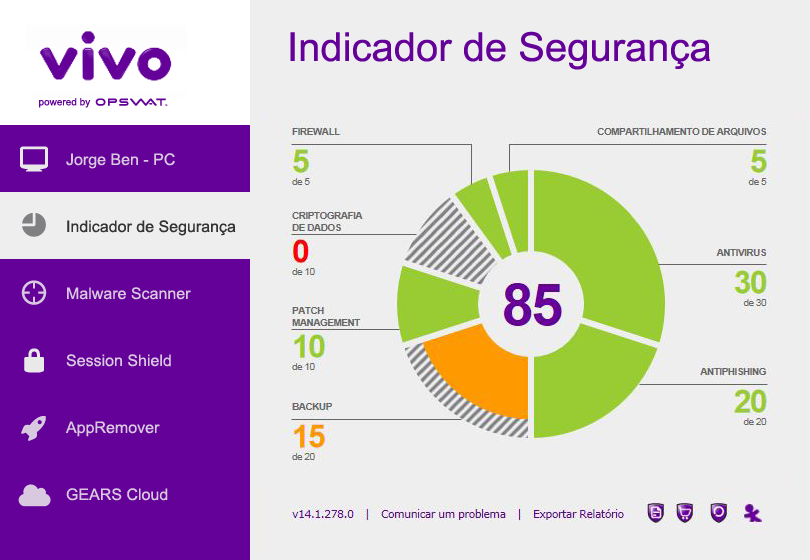

<section class="grid indenter:3/5 flip-top:kid border-top:3px border-accent:cyan">
## Background 
OPSWAT wanted to provide third party vendors the freedom to rebrand our desktop application, SecurityScore, to suit their specific needs.

---

### Goal 
To produce a design systems document that would allow third-party vendors to easily rebrand our application for their specific markets.

---

### My Role 
Create guidelines on how external vendors could rebrand the application, identifying components and how they relate.

</section>

<section class="grid indenter:3/5 split-lists flip-top:kid border-top:3px border-accent:magenta">
## Process 
1. Met with stakeholders to understand the requirements and technical limitations
1. Studied existing mockups and design assets
1. Identified four main areas that the system should cover:
    * Application states
    * Application elements
    * Colors and images
    * Customization options

After outlining the first three areas, I met with the marketing and engineering teams to finalize the customization options before working with the  technical writer to draft the guidelines.

</section>

<section class="grid indenter:3/5 flip-top:kid border-top:3px border-accent:yellow">
## Outcome
The guidelines codified how third party vendors would submit customization requests, making clear what could and could not be changed. It also provided us with an internal methodology for defining and documenting OPSWAT's digital products.

</section>

