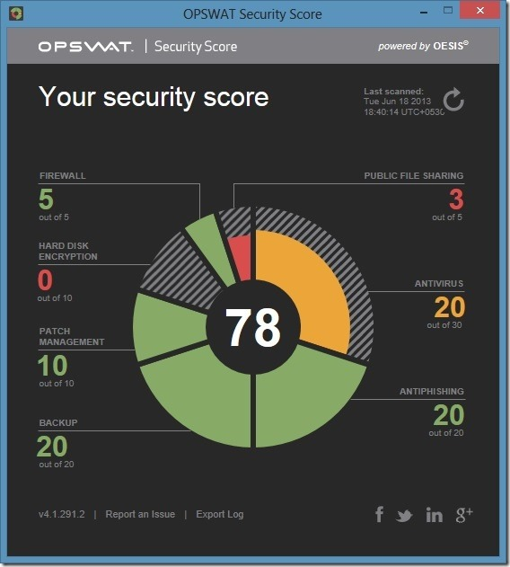
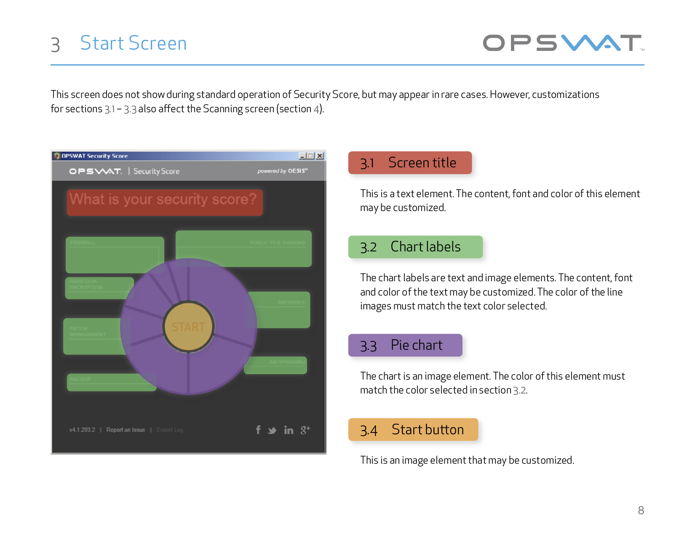
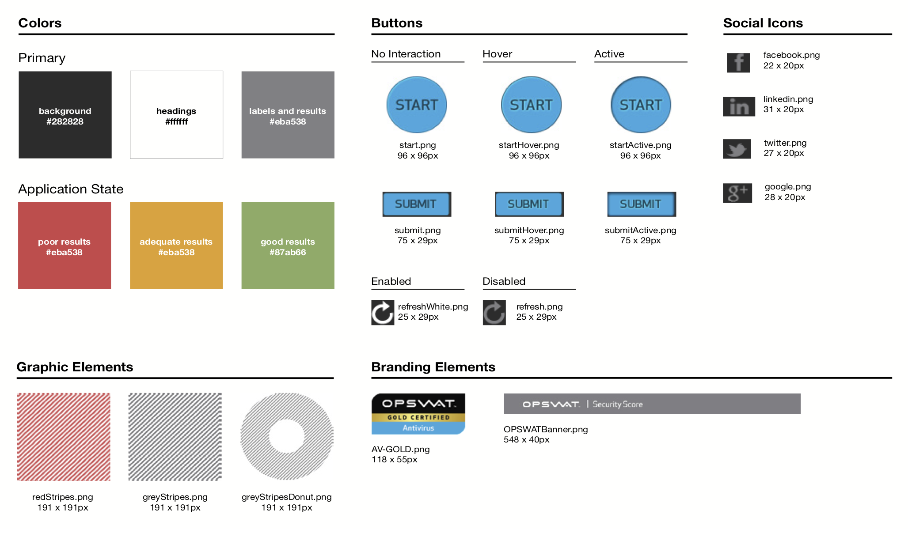
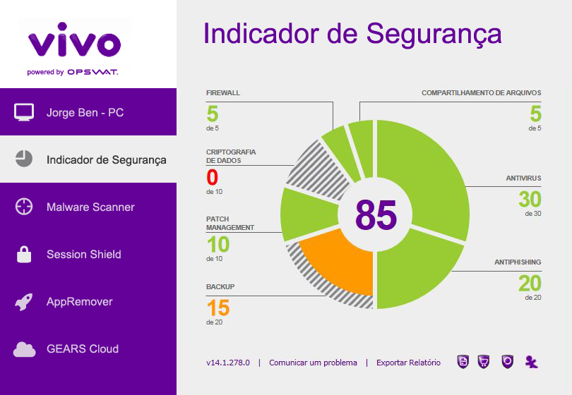

Identifying discreet parts of an application

*adding more context about why IDing parts is important to the project or just projects at large*

<section>

## Background
OPSWAT wanted to provide third party vendors the freedom to rebrand our desktop application, SecurityScore, to suit their specific needs.{.half}

{.half .left}

</section>

## Goal
Create guidelines on how external vendors could rebrand the application.

## Role
To produce a design system document that would allow third-party vendors to easily rebrand our application for their specific markets.

> should I stick with calling this "Branding Guidelines" or call it (kinda obtusely) a "Design System" to score more points?

## Process
- Met with stakeholders to understand the requirements and technical limitations
- Studied existing mockups and design assets
- Identified four main areas that the system should cover:
	- Application states
	- Application elements
	- Colors and images
	- Customization options

After outlining the first three areas, I met with the marketing and engineering teams to finalize the customization options before working with the  technical writer to draft the guidelines.

## Outcome
Defined parts of the application that could be customized, defining a framework for how third party vendors could rebrand the application for their market / how the could approach branding / how they could thing about it... making clear what could and could not be changed.  It also provided us with an internal methodology for for defining and documenting OPSWAT's digital products.

The guidelines defined a process for how third party vendors submit customization requests, making clear what could and could not be changed.  It also provided us with an internal methodology for for defining and documenting OPSWAT's digital products.

